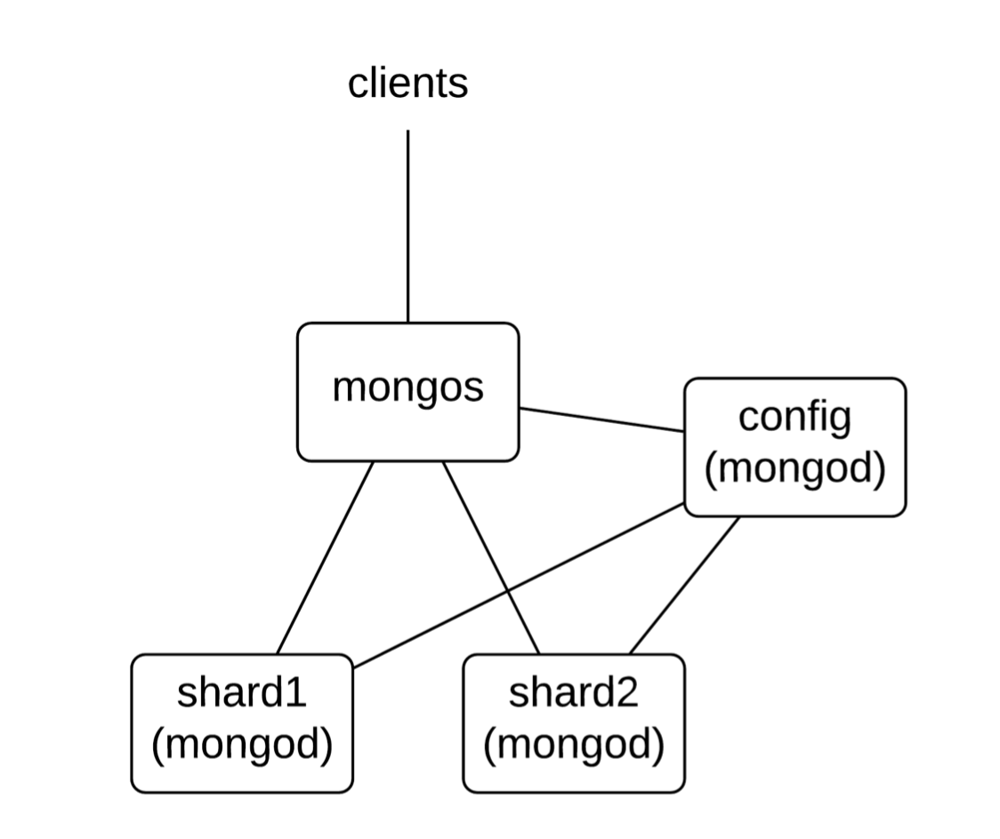

# Assignment A2 - MongoDB

___

Group members:

* Adam Lass
* Rasmus Helsgaun
* Pernille Lørup

___


###Exercise: Sharding in MongoDB
**What is sharding in mongoDB?**  
Sharding is a method for distributing data across multiple machines. MongoDB uses sharding to support deployments with very large data sets and high throughput operations.

**What are the different components required to implement sharding?**  
To implement sharding you will need the following components:  

* **Mongod servers(shards)** - These are the nonreplica mongod servers which are flagged as a shard(--shardsvr). For the server to be able to considered a shard server there’s a special parameter necessary: 
```$mongod --shardsvr --dbpath ./server-name --port port-number ``` 

* **Config server** - This is basically a regular mongod server that keeps track of the values of the other servers. 
* **Mongos server** - The server of which the client communicates with. The mongos is an almost identical clone of a mongod server. The mongos servers are used to connect to the sharded servers and the config server as well to keep track of the sharding information stored there. There can be one or more mongos servers. 

**Explain architecture of sharding in mongoDB?**  
The model below reflects an example of a simple distributed instance of a sharded mongodb.  
We can see the mongos query router acting as an interface between client applications and the sharded cluster. With its config companion (mongod) they provide the very basic setup for implementing sharding in mongoDB. From here you can add more shards depending on your needs but sharding can only be obtained with a minimum of two shards. 


___


###Exercise: MapReduce with mongoDB (warmup)
As a first exercise you are required to load reddit data from the link mentioned in 2). With help of map and reduce you need to find top 10 “lang” (language) of the documents in reddit.  

We loaded the dataset 'countries-big.json' from the provided link. And ran the following command in the terminal from the folder in which we stored the data.

```
mongoimport --db earth --collection countries --drop --file countries-big.json
```

**a) Provide implementation of map and reduce function**  

```javascript
map = function() {
	emit({
   		Language: this.Language,
		}, {count : 1 });
}
```

```javascript
reduce = function(key, values) {
	var total = 0;
	for (var i = 0; i < values.length; i++) {
   		total += values[i].count;
  	}
return { count : total }; }
```

**b) Provide execution command for running MapReduce**  

```javascript
results = db.runCommand({ 
	mapReduce: 'countries', 
	map: map,
	reduce: reduce,
	out: 'countries.report' 
})
```

**c) Provide top 10 recorded out of the sorted result. (hint: use sort on the result returned by MapReduce)**  

```javascript
db.countries.report.aggregate([{$sort: {value: -1}}])
```

```javascript
{ "_id" : { "Language" : "en" }, "value" : { "count" : 300 } }
{ "_id" : { "Language" : "bn" }, "value" : { "count" : 284 } }
{ "_id" : { "Language" : "cs" }, "value" : { "count" : 284 } }
{ "_id" : { "Language" : "gu" }, "value" : { "count" : 284 } }
{ "_id" : { "Language" : "hi" }, "value" : { "count" : 284 } }
{ "_id" : { "Language" : "kn" }, "value" : { "count" : 284 } }
{ "_id" : { "Language" : "ml" }, "value" : { "count" : 284 } }
{ "_id" : { "Language" : "mr" }, "value" : { "count" : 284 } }
{ "_id" : { "Language" : "or" }, "value" : { "count" : 284 } }
{ "_id" : { "Language" : "sk" }, "value" : { "count" : 284 } }
```
___

###Exercise: MapReduce with mongoDB (hashtag query) (5 points)
For this task you need to download twitter dataset from the link mentioned in 2). This time you have to answer query “what are the top 10 hashtags used in the given tweets”. To answer this you need to use MapReduce. You can look at the scheme of the collection using db.collection.findOne(). It will print one record with scheme information. Also you can use function like this.hasOwnProperty(‘field_name’) to check if a field exist in the record. (if the field does not exist you will get error.   


We loaded the dataset 'tweets.bson' from the provided link. And ran the following command in the terminal from the folder in which we stored the data.

```
mongorestore --db twitter --collection tweet twitter/tweets.bson
```

**a) Provide implementation of map and reduce function**   

First, we’ll store a helper function that extracts an array of all hashtags.

**hashtag.js**

```javascript
allHashtags = function(tweet){
if(tweet.entities == undefined) return [];
var hashtags = tweet.entities.hashtags;
var result = [];
hashtags.forEach(hashtag => result.push(hashtag.text))

return result; }

db.system.js.save({_id: 'allHashtags', value: allHashtags})
```
**map.js**

```javascript
map = function() {
var hashtags = allHashtags(this);
hashtags.forEach(hashtag => emit({Hashtag: hashtag}, {count: 1}))
}
```
**reduce.js**

```javascript
reduce = function(key, values) {
	var total = 0;
	for (var i = 0; i < values.length; i++) {
   		total += values[i].count;
  	}
return { count : total }; }
```

**b) Provide execution command for running MapReduce**  

```javascript
results = db.runCommand({ 
	mapReduce: 'tweet', 
	map: map,
	reduce: reduce,
	out: 'tweet.report' 
})
```

**c) Provide top 10 recorded out of the sorted result. (hint: use sort on the result returned by MapReduce)**  

```javascript
db.tweet.report.aggregate([{$sort: {value: -1}}])
```

```javascript
{ "_id" : { "Hashtag" : "FCBLive" }, "value" : { "count" : 27 } }
{ "_id" : { "Hashtag" : "AngularJS" }, "value" : { "count" : 21 } }
{ "_id" : { "Hashtag" : "nodejs" }, "value" : { "count" : 20 } }
{ "_id" : { "Hashtag" : "LFC" }, "value" : { "count" : 19 } }
{ "_id" : { "Hashtag" : "EspanyolFCB" }, "value" : { "count" : 18 } }
{ "_id" : { "Hashtag" : "IWCI" }, "value" : { "count" : 16 } }
{ "_id" : { "Hashtag" : "webinar" }, "value" : { "count" : 16 } }
{ "_id" : { "Hashtag" : "GlobalMoms" }, "value" : { "count" : 14 } }
{ "_id" : { "Hashtag" : "javascript" }, "value" : { "count" : 14 } }
{ "_id" : { "Hashtag" : "RedBizUK" }, "value" : { "count" : 12 } }
```

